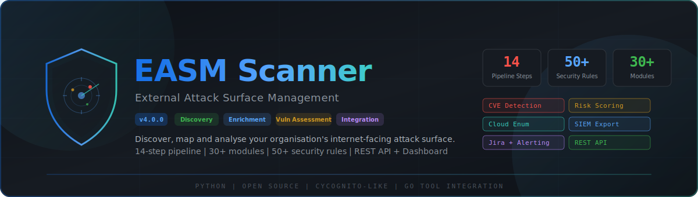

<p align="center">
  
</p>

<p align="center">
  <strong>Discover, map and analyse your organisation's internet-facing attack surface</strong>
</p>

<p align="center">
  
  
  
  
  
  
</p>

---

## Table of Contents

- [Overview](#overview)
- [Key Features](#key-features)
- [Architecture](#architecture)
  - [14-Step Pipeline](#14-step-pipeline)
  - [Project Structure](#project-structure)
- [Getting Started](#getting-started)
  - [Prerequisites](#prerequisites)
  - [Installation](#installation)
  - [Quick Start](#quick-start)
- [Usage](#usage)
  - [Basic Scanning](#basic-scanning)
  - [Advanced Options](#advanced-options)
  - [REST API & Dashboard](#rest-api--dashboard)
  - [Scheduled Scanning](#scheduled-scanning)
  - [Alerting](#alerting)
  - [SIEM Integration](#siem-integration)
  - [Jira Integration](#jira-integration)
- [Pipeline Deep Dive](#pipeline-deep-dive)
  - [Phase 1 — Discovery](#phase-1--discovery)
  - [Phase 2 — Enrichment](#phase-2--enrichment)
  - [Phase 3 — Vulnerability Assessment](#phase-3--vulnerability-assessment)
  - [Phase 4 — Reporting & Integration](#phase-4--reporting--integration)
- [Security Rules Reference](#security-rules-reference)
- [Risk Scoring](#risk-scoring)
  - [Formula](#formula)
  - [Auto-Escalation Rules](#auto-escalation-rules)
- [REST API Reference](#rest-api-reference)
- [Dashboard](#dashboard)
- [Safety Caps](#safety-caps)
- [Dependencies](#dependencies)
- [Contributing](#contributing)
- [License](#license)

---

## Overview

**EASM Scanner** is a comprehensive External Attack Surface Management platform built in Python. Inspired by commercial solutions like CyCognito, Censys and Mandiant ASM, it provides a fully automated 14-step pipeline that discovers, enriches, assesses and reports on your organisation's internet-facing assets.

The scanner wraps high-performance Go-based tools from [ProjectDiscovery](https://projectdiscovery.io/) (subfinder, httpx, dnsx, naabu, nuclei, etc.) while providing **pure-Python fallbacks** for every capability — meaning it works out of the box without any Go tooling installed.

### What Makes It Different

| Capability | EASM Scanner |
|-----------|-------------|
| **Zero external dependencies** | Works with just `requests` + `dnspython`; Go tools are optional accelerators |
| **14-step automated pipeline** | From seed ingestion through risk-scored findings in a single command |
| **50+ security rules** | Covering exposed services, misconfigurations, CVEs, DNS, TLS, cloud storage, credentials |
| **Multi-factor risk scoring** | 4-component formula with auto-escalation (CISA KEV, default creds, takeover) |
| **Built-in integrations** | REST API, dashboard, Slack/Teams/Email alerts, Splunk/Elasticsearch SIEM, Jira ticketing |
| **Diff-based scheduling** | Detect new, resolved and unchanged findings across scans |
| **Single-file deployment** | Each module is self-contained with its own dataclasses |

---

## Key Features

### Discovery & Reconnaissance
- Subdomain enumeration (crt.sh, subfinder, DNS brute-force)
- Certificate Transparency log monitoring
- ASN-to-CIDR prefix expansion (BGPView, RIPE, asnmap)
- Bulk DNS resolution with record-type awareness
- TCP port scanning with service detection and banner grabbing
- HTTP probing with technology fingerprinting

### Enrichment & Attribution
- WHOIS/RDAP lookup with registrant extraction
- TLS certificate chain analysis (expiry, cipher suites, key strength)
- GeoIP enrichment with ISP/ASN data
- Technology fingerprinting (150+ signatures for web frameworks, CMS, CDN, WAF)
- Multi-signal organisation attribution with confidence scoring
- In-memory asset relationship graph with BFS traversal

### Vulnerability Assessment
- **CVE Detection** — Version fingerprinting against 25+ CVE entries for 10 products, enriched with EPSS scores and CISA KEV cross-referencing
- **Nuclei Scanning** — Go binary wrapper plus 15 built-in Python templates as fallback
- **Subdomain Takeover** — Dangling DNS/CNAME detection across 25 cloud providers (AWS, Azure, GitHub Pages, Heroku, Netlify, Vercel, Shopify, Fastly, etc.)
- **Web Misconfiguration** — 39 sensitive path checks (.env, .git, backups, debug endpoints, admin panels, Swagger), CORS misconfiguration, open redirect, directory listing
- **Default Credentials** — Testing across 8 service types (SSH, FTP, HTTP, SNMP, MySQL, PostgreSQL, Redis, MongoDB) with 36 credential pairs
- **DNS Security** — SPF/DKIM/DMARC validation, zone transfer (AXFR) testing, CAA record checks, dangling MX detection
- **Cloud Storage** — S3, Azure Blob and GCS bucket enumeration with public access testing
- **Risk Scoring** — Multi-factor scoring engine with 5 auto-escalation rules

### Reporting & Integration
- **REST API** — 14 FastAPI endpoints for programmatic access
- **Interactive Dashboard** — Dark-themed SPA with severity charts, asset inventory, risk scores, scan launcher
- **Multi-Channel Alerting** — Email (SMTP/TLS), Slack (Block Kit), Microsoft Teams (MessageCard), generic webhooks, console
- **SIEM Export** — Splunk HEC (batched), Elasticsearch (bulk API), Syslog CEF (UDP/TCP), CSV, JSON Lines
- **Jira Integration** — Cloud/Server REST API v2, severity-to-priority mapping, JQL deduplication, dry-run mode
- **Scan Scheduling** — SQLite-backed history with finding/asset diff detection and alert triggers

---

## Architecture

### 14-Step Pipeline

```
                            EASM Scanner Pipeline
 ============================================================================

  PHASE 1 — DISCOVERY                    PHASE 2 — ENRICHMENT
  +-------------------+                  +-------------------+
  | 1. Seed Ingestion |                  | 7. WHOIS Lookup   |
  | 2. ASN Expansion  |                  | 8. TLS Analysis   |
  | 3. Subdomain Enum |   ==========>   | 9. GeoIP + Tech   |
  | 4. DNS Resolution |                  |10. Attribution    |
  | 5. Port Scanning  |                  +-------------------+
  | 6. HTTP Probing   |                           |
  +-------------------+                           v
                                         PHASE 3 — VULN ASSESSMENT
                                         +---------------------+
          PHASE 4 — INTEGRATION          |11. CVE + Nuclei     |
          +-------------------+          |12. Misconfig+Takeover|
          | REST API          |  <====   |13. Creds + DNS Sec  |
          | Dashboard         |          |14. Risk Scoring     |
          | Alerts + SIEM     |          +---------------------+
          | Jira + Scheduler  |
          +-------------------+
```

### Project Structure

```
easm_scanner.py                  Main orchestrator, CLI, 14-step pipeline, reporting
models/
  asset.py                       Asset dataclass (domain, ip, port, url, cert, asn, cidr)
  finding.py                     Finding dataclass with severity ranking
modules/
  # Phase 1 — Discovery
  seed_manager.py                Seed parsing (domains, IPs, CIDRs, ASNs, files)
  asn_mapper.py                  ASN-to-CIDR via BGPView / RIPE / asnmap
  subdomain_discovery.py         crt.sh + subfinder + DNS brute-force
  dns_resolver.py                Bulk DNS resolution + dnsx wrapper
  port_scanner.py                TCP scanner + naabu + banner grab
  http_prober.py                 HTTP probe + tech fingerprint + httpx wrapper
  ct_monitor.py                  Certificate Transparency via crt.sh
  asset_store.py                 SQLite-backed asset + finding storage

  # Phase 2 — Enrichment
  whois_enrichment.py            RDAP + whois CLI, registrant extraction
  tls_analyzer.py                Cert chain, cipher suites, expiry, key strength + tlsx
  geoip_enrichment.py            ip-api.com batch + single lookups
  tech_fingerprint.py            150+ signatures (headers, cookies, body, meta)
  screenshot_capture.py          gowitness wrapper for visual recon
  attribution_engine.py          Multi-signal org attribution (7 signal types)
  asset_graph.py                 In-memory adjacency-list graph, BFS traversal

  # Phase 3 — Vulnerability Assessment
  vuln_detector.py               CVE detection via version fingerprinting + NVD/EPSS
  nuclei_scanner.py              Nuclei Go wrapper + 15 built-in Python templates
  subdomain_takeover.py          Dangling DNS/CNAME detection (25 cloud providers)
  misconfig_detector.py          39 sensitive paths, CORS, open redirect, directory listing
  default_creds.py               Default credential testing (8 service types, 36 pairs)
  dns_security.py                SPF/DKIM/DMARC, zone transfer (AXFR), CAA, MX checks
  cloud_enum.py                  S3/Azure Blob/GCS bucket enumeration + access testing
  risk_scorer.py                 Multi-factor risk scoring with auto-escalation

  # Phase 4 — Reporting & Integration
  alerting.py                    Multi-channel alerting (Email/Slack/Teams/Webhook/Console)
  siem_export.py                 SIEM export (Splunk HEC/Elasticsearch/Syslog/CSV/JSONL)
  jira_integration.py            Jira Cloud/Server ticket creation with deduplication
  scheduler.py                   SQLite-backed scan scheduling with diff detection

api/
  server.py                      FastAPI REST API server (14 endpoints)
  dashboard.py                   Dashboard data renderer

templates/
  dashboard.html                 Interactive single-page dashboard (dark theme)

config/
  settings.yaml                  Default configuration (threads, resolvers, ports)

wordlists/
  subdomains-top1000.txt         Common subdomain prefixes for brute-force
```

---

## Getting Started

### Prerequisites

- **Python 3.10+**
- **pip** (Python package manager)

### Installation

```bash
# Clone the repository
git clone https://github.com/Krishcalin/Attack-Surface-Management.git
cd Attack-Surface-Management

# Install required dependencies
pip install -r requirements.txt

# (Optional) Install Go tools for faster scanning
go install -v github.com/projectdiscovery/subfinder/v2/cmd/subfinder@latest
go install -v github.com/projectdiscovery/httpx/cmd/httpx@latest
go install -v github.com/projectdiscovery/dnsx/cmd/dnsx@latest
go install -v github.com/projectdiscovery/naabu/v2/cmd/naabu@latest
go install -v github.com/projectdiscovery/nuclei/v3/cmd/nuclei@latest

# (Optional) Install credential testing libraries
pip install paramiko mysql-connector-python psycopg2-binary pymongo
```

### Quick Start

```bash
# Full scan against a domain
python easm_scanner.py -d example.com --org "ACME Corp" -v

# Scan with HTML and JSON output
python easm_scanner.py -d example.com --html report.html --json scan.json

# Scan and launch the web dashboard
python easm_scanner.py -d example.com --serve --port 8888
```

---

## Usage

### Basic Scanning

```bash
# Single domain scan
python easm_scanner.py -d example.com

# Multiple domains
python easm_scanner.py -d example.com acme.org staging.example.io

# IP addresses
python easm_scanner.py -i 10.0.0.1 172.16.0.1

# ASN expansion
python easm_scanner.py --asn AS15169 AS13335

# CIDR ranges
python easm_scanner.py --cidr 192.168.1.0/24

# Seed file (one target per line)
python easm_scanner.py --seed-file targets.txt

# Combined seeds with org context
python easm_scanner.py -d example.com --asn AS15169 --cidr 10.0.0.0/24 --org "ACME Corp"
```

### Advanced Options

```bash
# Skip specific phases
python easm_scanner.py -d example.com --skip-ports             # No port scanning
python easm_scanner.py -d example.com --skip-enrichment        # Skip Phase 2
python easm_scanner.py -d example.com --skip-vuln-assessment   # Skip Phase 3
python easm_scanner.py -d example.com --skip-nuclei            # Skip Nuclei
python easm_scanner.py -d example.com --skip-cred-test         # Skip credential testing

# Custom settings
python easm_scanner.py -d example.com --threads 100            # Adjust concurrency
python easm_scanner.py -d example.com --severity HIGH          # Filter output
python easm_scanner.py -d example.com --db scan.db             # Persistent SQLite storage
python easm_scanner.py -d example.com --nuclei-templates /path # Custom Nuclei templates

# Output formats
python easm_scanner.py -d example.com --json scan.json         # JSON report
python easm_scanner.py -d example.com --html report.html       # HTML report
python easm_scanner.py -d example.com --siem-csv findings.csv  # CSV export
python easm_scanner.py -d example.com --siem-jsonl findings.jsonl  # JSONL export
```

### REST API & Dashboard

```bash
# Start the API server after scanning
python easm_scanner.py -d example.com --serve

# Custom port
python easm_scanner.py -d example.com --serve --port 9090
```

Once started, access:
- **Dashboard**: `http://localhost:8888/`
- **API Docs**: `http://localhost:8888/docs` (Swagger UI)
- **Health Check**: `http://localhost:8888/api/health`

### Scheduled Scanning

```bash
# Scan every 60 minutes with diff detection
python easm_scanner.py -d example.com --schedule 60

# Scheduled scan with alerts on new findings
python easm_scanner.py -d example.com --schedule 60 \
  --alert-slack https://hooks.slack.com/services/T.../B.../xxx
```

The scheduler uses SQLite to track scan history and computes diffs between runs, identifying new, resolved and unchanged findings.

### Alerting

```bash
# Slack alerts
python easm_scanner.py -d example.com \
  --alert-slack https://hooks.slack.com/services/T.../B.../xxx

# Microsoft Teams alerts
python easm_scanner.py -d example.com \
  --alert-teams https://outlook.office.com/webhook/...

# Generic webhook
python easm_scanner.py -d example.com \
  --alert-webhook https://api.example.com/easm-alerts

# Email alerts (SMTP settings via environment variables)
export SMTP_HOST=smtp.gmail.com SMTP_PORT=587 SMTP_USER=alerts@company.com
export SMTP_PASSWORD=app-password SMTP_FROM=alerts@company.com
python easm_scanner.py -d example.com --alert-email-to sec-team@company.com
```

Alerts are sent when **CRITICAL** or **HIGH** severity findings are discovered. Findings are deduplicated to prevent repeat notifications.

### SIEM Integration

```bash
# Splunk HEC
python easm_scanner.py -d example.com \
  --siem-splunk-url https://splunk.company.com:8088 \
  --siem-splunk-token your-hec-token

# Elasticsearch
python easm_scanner.py -d example.com \
  --siem-elastic-url https://es.company.com:9200

# CSV / JSON Lines file export
python easm_scanner.py -d example.com \
  --siem-csv findings.csv --siem-jsonl findings.jsonl
```

### Jira Integration

```bash
# Create Jira tickets for CRITICAL and HIGH findings
python easm_scanner.py -d example.com \
  --jira-url https://company.atlassian.net \
  --jira-project SEC \
  --jira-user admin@company.com \
  --jira-token your-api-token
```

Tickets include structured descriptions with rule ID, severity, asset, evidence and remediation guidance. The integration checks for existing tickets via JQL to prevent duplicates.

---

## Pipeline Deep Dive

### Phase 1 — Discovery

| Step | Module | Description |
|------|--------|-------------|
| 1 | `seed_manager.py` | Parse and validate seeds (domains, IPs, CIDRs, ASNs) from CLI args or file |
| 2 | `asn_mapper.py` | Expand ASNs to CIDR prefixes via BGPView and RIPE APIs |
| 3 | `subdomain_discovery.py` | Enumerate subdomains via crt.sh, subfinder, and DNS brute-force |
| 4 | `dns_resolver.py` | Bulk DNS resolution (A, AAAA, CNAME, MX, TXT) with dnsx acceleration |
| 5 | `port_scanner.py` | TCP connect scan with naabu wrapper, service detection, banner grabbing |
| 6 | `http_prober.py` | HTTP/HTTPS probing, status codes, title extraction, tech fingerprinting |

### Phase 2 — Enrichment

| Step | Module | Description |
|------|--------|-------------|
| 7 | `whois_enrichment.py` | RDAP/WHOIS lookup, registrant extraction, domain expiry monitoring |
| 8 | `tls_analyzer.py` | Certificate chain analysis, cipher suites, key strength, expiry detection |
| 9 | `geoip_enrichment.py` + `tech_fingerprint.py` | IP geolocation (ip-api.com) + 150+ technology signatures |
| 10 | `attribution_engine.py` + `asset_graph.py` | Multi-signal org attribution (7 signal types) + relationship graph |

### Phase 3 — Vulnerability Assessment

| Step | Module | Description |
|------|--------|-------------|
| 11 | `vuln_detector.py` + `nuclei_scanner.py` | CVE fingerprinting (25+ CVEs, 10 products) + Nuclei template scanning |
| 12 | `misconfig_detector.py` + `subdomain_takeover.py` + `cloud_enum.py` | Web misconfiguration (39 paths) + takeover (25 providers) + cloud storage |
| 13 | `default_creds.py` + `dns_security.py` | Default credential testing (8 services) + SPF/DKIM/DMARC/AXFR checks |
| 14 | `risk_scorer.py` | Multi-factor risk scoring with auto-escalation rules |

### Phase 4 — Reporting & Integration

| Module | Description |
|--------|-------------|
| `api/server.py` | FastAPI REST API with 14 endpoints for scan management, queries and export |
| `api/dashboard.py` | Dashboard data renderer with scan data injection |
| `templates/dashboard.html` | Interactive SPA: overview, findings, assets, risk scores, scan launcher |
| `alerting.py` | Multi-channel alerting (Email, Slack, Teams, Webhook, Console) |
| `siem_export.py` | SIEM export (Splunk HEC, Elasticsearch, Syslog CEF, CSV, JSONL) |
| `jira_integration.py` | Jira ticket creation with deduplication and priority mapping |
| `scheduler.py` | Scan scheduling with SQLite-backed diff detection |

---

## Security Rules Reference

### Exposed Services (`EASM-PORT-*`)

| Rule ID | Name | Severity |
|---------|------|----------|
| EASM-PORT-001 | Database Port Exposed to Internet | CRITICAL |
| EASM-PORT-002 | RDP Exposed to Internet | HIGH |
| EASM-PORT-003 | Telnet Exposed to Internet | HIGH |
| EASM-PORT-004 | FTP Exposed to Internet | MEDIUM |
| EASM-PORT-005 | VNC Exposed to Internet | HIGH |
| EASM-PORT-006 | SMB Exposed to Internet | CRITICAL |

### Security Headers (`EASM-HTTP-*`)

| Rule ID | Name | Severity |
|---------|------|----------|
| EASM-HTTP-001 | Missing Strict-Transport-Security | MEDIUM |
| EASM-HTTP-002 | Missing Content-Security-Policy | LOW |
| EASM-HTTP-003 | Missing X-Content-Type-Options | LOW |
| EASM-HTTP-004 | Server Version Disclosed | INFO |
| EASM-HTTP-005 | Missing X-Frame-Options | LOW |

### TLS / SSL (`EASM-TLS-*`)

| Rule ID | Name | Severity |
|---------|------|----------|
| EASM-TLS-001 | HTTP Service Without TLS | MEDIUM |
| EASM-TLS-002 | Self-Signed Certificate | HIGH |
| EASM-TLS-003 | Expired TLS Certificate | CRITICAL |
| EASM-TLS-004 | TLS Certificate Expiring Soon | MEDIUM |
| EASM-TLS-005 | Weak RSA Key (< 2048 bits) | HIGH |

### Domain (`EASM-WHOIS-*`)

| Rule ID | Name | Severity |
|---------|------|----------|
| EASM-WHOIS-001 | Domain Expiring Soon | MEDIUM |
| EASM-WHOIS-002 | DNSSEC Not Enabled | LOW |

### Vulnerability Assessment (`EASM-*`)

| Rule ID | Name | Severity |
|---------|------|----------|
| EASM-TAKEOVER-001 | Subdomain Takeover Vulnerability | HIGH |
| EASM-CVE-001 | Known CVE Detected | HIGH |
| EASM-CRED-001 | Default Credentials Accepted | CRITICAL |
| EASM-CLOUD-001 | Public Cloud Storage Bucket | CRITICAL |
| EASM-MISCONFIG-001..010 | Web Misconfigurations | MEDIUM-HIGH |
| EASM-DNS-001..006 | DNS Security Issues | MEDIUM-HIGH |
| EASM-NUCLEI-* | Dynamic Nuclei Template Matches | Varies |

---

## Risk Scoring

### Formula

```
Risk Score = (Severity x 0.40) + (Asset Criticality x 0.35)
           + (Exploitability x 0.15) + (Temporal x 0.10)
```

| Component | Weight | Range | Inputs |
|-----------|--------|-------|--------|
| **Severity** | 40% | 0-40 | CVSS base score or rule severity (CRITICAL=10, HIGH=8, MEDIUM=5, LOW=2) |
| **Asset Criticality** | 35% | 0-35 | Asset type, service multiplier, category boost |
| **Exploitability** | 15% | 0-15 | EPSS score, CISA KEV, public exploit availability, CVE existence |
| **Temporal** | 10% | 0-10 | Active exploitation status, disclosure recency |

**Score-to-Level Mapping:**

| Score | Risk Level |
|-------|-----------|
| >= 80 | CRITICAL |
| >= 60 | HIGH |
| >= 40 | MEDIUM |
| >= 20 | LOW |
| < 20 | INFO |

### Auto-Escalation Rules

| # | Condition | Escalated Score |
|---|-----------|----------------|
| 1 | CISA KEV + score >= 50 | 90+ (CRITICAL) |
| 2 | Default credentials on CRITICAL service | 95+ (CRITICAL) |
| 3 | Confirmed subdomain takeover | 85+ (CRITICAL) |
| 4 | Public cloud bucket with data | 90+ (CRITICAL) |
| 5 | CRITICAL CVE + public exploit + score >= 60 | 88+ (CRITICAL) |

---

## REST API Reference

| Method | Endpoint | Description |
|--------|----------|-------------|
| `GET` | `/api/health` | Health check and scan status |
| `POST` | `/api/scan` | Launch a new scan (JSON body with domains, IPs, ASNs, skip options) |
| `GET` | `/api/scan/status` | Current scan progress (running, completed, failed) |
| `GET` | `/api/scan/history` | Scan history with severity counts |
| `GET` | `/api/summary` | Latest scan summary (assets, findings, enrichment, vuln stats) |
| `GET` | `/api/assets` | Asset inventory with type/search filtering and pagination |
| `GET` | `/api/findings` | Security findings with severity/category/search filters |
| `GET` | `/api/risk-scores` | Risk scores with aggregate statistics |
| `GET` | `/api/graph` | Asset relationship graph (adjacency list) |
| `GET` | `/api/export/json` | Export findings as JSON |
| `GET` | `/api/export/csv` | Export findings as CSV |
| `GET` | `/api/export/jsonl` | Export findings as JSON Lines |
| `POST` | `/api/alerts/test` | Send a test alert through all configured channels |
| `GET` | `/` | Interactive web dashboard |

Start the API with:
```bash
python easm_scanner.py -d example.com --serve --port 8888
```

Swagger/OpenAPI docs are available at `http://localhost:8888/docs`.

---

## Dashboard

The interactive dashboard is a dark-themed single-page application served at the root URL (`/`) of the API server.

**Pages:**

| Tab | Features |
|-----|----------|
| **Overview** | Stat cards (assets, severity counts), severity/category bar charts, enrichment summary, vuln assessment stats, top findings table |
| **Findings** | Full findings table with search, severity filter, category filter, JSON/CSV export buttons |
| **Assets** | Asset inventory with type filter and search, pagination |
| **Risk Scores** | Risk score table with aggregate stat cards, min-score slider filter, escalation indicators |
| **New Scan** | Scan launch form (domains, IPs, ASNs, org, skip checkboxes), scan history table |

The dashboard automatically polls scan status and updates when a scan completes. It also supports **offline mode** with statically injected data for HTML report sharing.

---

## Safety Caps

To prevent accidental abuse or resource exhaustion, the scanner enforces the following limits:

| Operation | Safety Cap |
|-----------|-----------|
| CIDR expansion | Max /16 (65,536 hosts) |
| Port scan targets | Max 1,024 IPs |
| HTTP probe targets | Max 2,048 targets |
| GeoIP rate limiting | 1.4s between calls (ip-api.com free tier: 45/min) |
| Nuclei targets | Max 100 URLs |
| Misconfiguration scan | Max 50 URLs, 50 paths per URL |
| Cloud bucket candidates | Max 200 |
| Credential test targets | Max 50 |

---

## Dependencies

### Required

| Package | Version | Purpose |
|---------|---------|---------|
| `requests` | >= 2.31.0 | HTTP client for API calls |
| `dnspython` | >= 2.4.0 | DNS resolution and zone transfer |

### Optional — REST API

| Package | Version | Purpose |
|---------|---------|---------|
| `fastapi` | >= 0.104.0 | REST API framework (`--serve` mode) |
| `uvicorn` | >= 0.24.0 | ASGI server for FastAPI |

### Optional — Go Tools (Faster Scanning)

| Tool | Purpose |
|------|---------|
| `subfinder` | Subdomain enumeration |
| `httpx` | HTTP probing |
| `dnsx` | DNS resolution |
| `naabu` | Port scanning |
| `asnmap` | ASN mapping |
| `tlsx` | TLS analysis |
| `nuclei` | Template-based vulnerability scanning |
| `gowitness` | Screenshot capture |

### Optional — Credential Testing

| Package | Purpose |
|---------|---------|
| `paramiko` | SSH credential testing |
| `mysql-connector-python` | MySQL credential testing |
| `psycopg2-binary` | PostgreSQL credential testing |
| `pymongo` | MongoDB credential testing |

---

## Contributing

Contributions are welcome. Please follow these guidelines:

1. Each module should be self-contained with its own dataclass results
2. Every Go tool wrapper must have a pure-Python fallback
3. Use `_vprint()` for verbose output, gated by `self.verbose`
4. All network calls must have timeouts and exception handling
5. Use ASCII-only characters for console output (Windows compatibility)
6. Rule IDs follow the format `EASM-{CATEGORY}-{NNN}`
7. Severity levels: `CRITICAL > HIGH > MEDIUM > LOW > INFO`

---

## License

This project is licensed under the MIT License. See [LICENSE](LICENSE) for details.

---

<p align="center">
  <sub>Built with Python | Powered by ProjectDiscovery | Inspired by CyCognito</sub>
</p>
